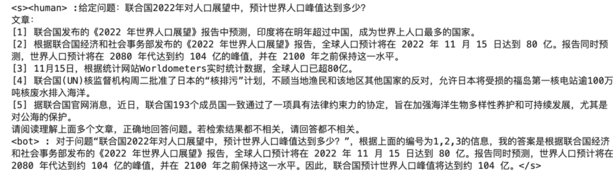

# My NLP Research Archive

这是一个个人档案库，用于收集和整理我平时认为有价值的研究论文、项目和其他资源。主要关注自然语言处理（NLP）领域的论文，但也包括一些相关的研究和项目，以增强我的知识和理解。

## 概述

在这个仓库中，我会定期更新我阅读的论文和项目，包括论文的名称、地址以及我认为重要的地方。这些资源将帮助我更好地理解NLP及其相关领域的最新进展。

## 论文列表

### 大模型

1. **论文名称**: [Never Lost in the Middle: Improving Large Language Models via Attention Strengthening Question Answering](https://arxiv.org/abs/2311.09198)

   - **重要部分**: 

     - 微调多文档问答能力。

     - 正样本构造：将复杂的多文档问答（Multi-doc QA）任务分解为三个子任务，分别是问题重复（Question Repetition, QR）、索引预测（Index Prediction, IP）和答案总结（Answer Summarization, AS），下边这个例子能很形象说明：

       

     - 负样本构造：

       - 70%基于检索的负样本：从文档集合中检索相关性较高的负样本，提高负样本的挑战性，增强模型的鲁棒性。假设问题是“什么是新冠病毒的主要症状？”正样本可能是一个详细描述新冠病毒症状的文档。基于检索的负样本可能是描述流感症状的文档，这些文档在某些方面与新冠病毒症状有关，但并不是正确答案。
       - 30%随机负样本：从负样本候选集合中随机抽取，提供负样本多样性，保持训练数据的代表性。

2. **论文名称**: [Another Paper Title](http://example.com)

   - **重要部分**:
     - 

## 项目

1. **项目名称**: [Example Project Title](http://example.com)
   - **描述**: 

## 资源

- **资源名称**: [Example Resource Title](http://example.com)
  - **描述**: 
